# 验证性实验


## 一.ipconfig验证实验
### $\color{orange}{1.实作1}$

我的网络配置
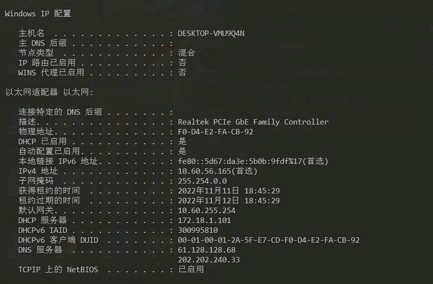

ip地址: 10.60.56.165

子网掩码：255.254.0.0

默认网关：10.60.255.254

### $\color{orange}{2.实作2}$

旁边的网络配置
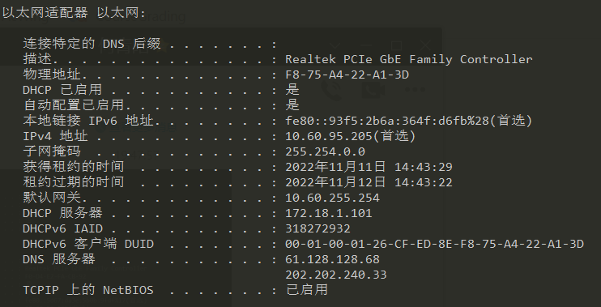

 <mark>不同</mark>:   物理地址，IP地址

 <mark>相同</mark>：子网掩码，默认网关

 <mark>问题</mark>：与旁边的计算机是否处于同一子网？

$\color{red}{答：}$ 
是处于同一子网中。我的IP地址与子网掩码AND后是10.60.0.0，相邻计算机的IP地址与子网掩码AND后也是10.60.0.0。

----

## 二.ping

### $\color{orange}{1.实作1}$
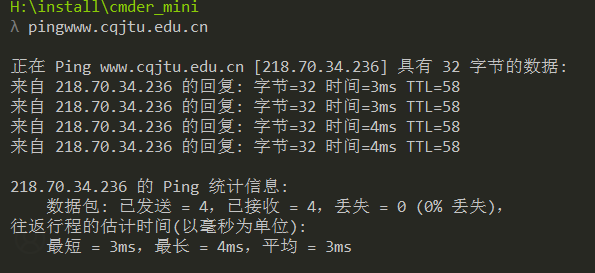

$\color{red}{TTL：}$  生存时间，IP数据包可以经过最大的路由器数量。当一个ip数据包每经过一个路由器时，该TTL的值就会减1，当经过的路由器个数超过TTL的值时，该IP数据包就会被路由器抛弃，这样就可以避免数据包在网络中无限传输。

$\color{red}{时间：}$  返回数据包最短时间，根据反应时间来判断网络连通情况


### $\color{orange}{2.实作2}$
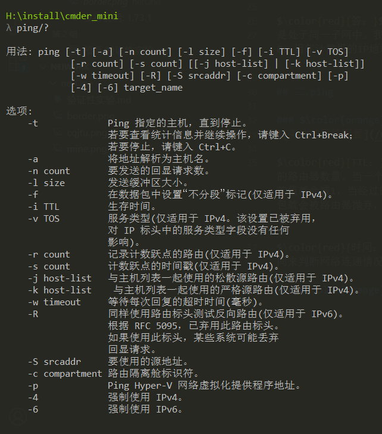
### $\color{orange}{TroubleShooting}$: 
假设你不能 ping 通某计算机或 IP，但你确定该计算机和你之间的网络是连通的，那么可能的原因是什么？该如何处理能保证 ping 通？

>1.ping 127.0.0.1 .测试自己计算机的状态,是否是自身网卡存在问题
>
>2.ping 旁边计算机.如果不成功的话，问题在本机网络出口到交换机之间，
>检查本机网卡到交换机的连线等;
>
>3.ping 网关，测试到网关的连通性，如果不成功的话，则是网关的问题;
>
>4.ping 14.215.177.39(百度IP之一)，如果不成功问题在网关以外;

### $\color{orange}{TroubleShooting}$: 
假设在秘籍中进行的网络排查中，ping 百度的 IP 即 ping 14.215.177.39 没问题，但 ping 百度的域名即 ping www.baidu.com 不行，那么可能的原因是什么？如何进行验证和解决？

另外，经常有同学问到的："能上 QQ，但不能上网" 跟这个问题的原因是相似的。

>原因：域名解析失败的问题，域名解析主要是在DSN中进行。而QQ不需要解析域名，所以能上qq。
>
>解决办法：
先清空DNS缓存:命令窗口ipconfig/flushdns;
再设置本机的DNS为谷歌的DNS 8.8.8.8
；最后再ping一次即可；如果还是Ping不通 则可联系给域名服务的服务商;


## 三.tracert

### $\color{orange}{1.实作1}$
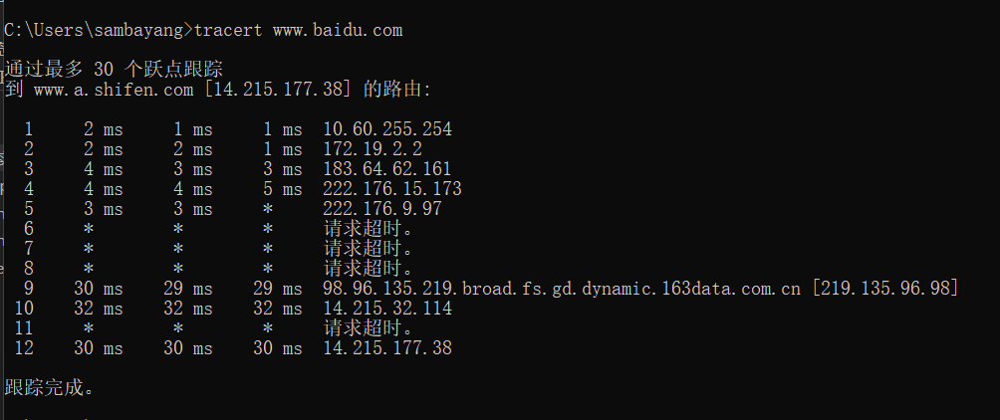
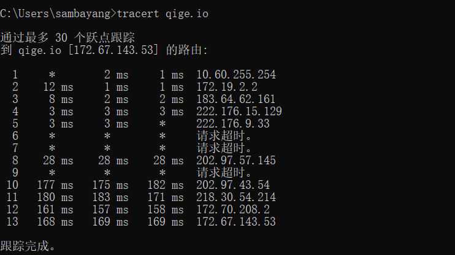

**百度：**

1：内网IP 内网IP

2：内网IP 内网IP

3：中国 重庆 重庆市 电信

4: 中国 重庆 重庆市 电信

9: 中国 广东省 广州市 电信

10: 中国 广东省 广州市 电信

12: 中国 广东省 广州市 电信


### $\color{orange}{2.实作2}$
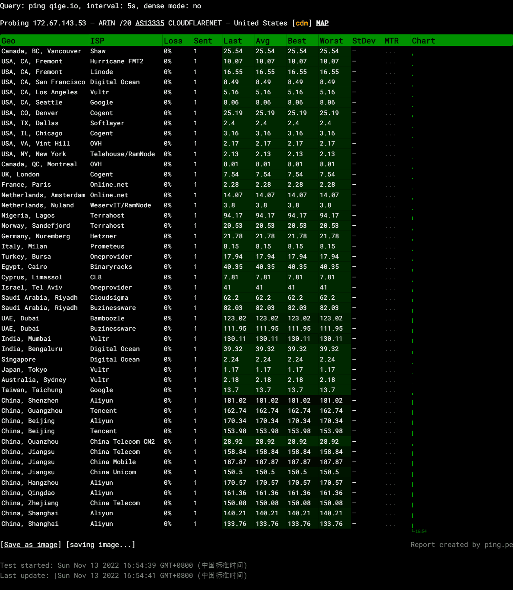

<mark >问题一</mark>：
tracert 能告诉我们路径上的节点以及大致的延迟等信息，那么它背后的原理是什么？本问题可结合第二部分的 Wireshark 实验进行验证。

>
通过向目标发送不同 IP 生存时间 (TTL) 值的“Internet 控制消息协议 (ICMP)”回应数据包，Tracert诊断程序确定到目标所采取的路由。
要求路径上的每个路由器在转发数据包之前至少将数据包上的 TTL 递减 1。数据包上的 TTL 减为 0 时，路由器应该将“ICMP 已超时”的消息发回源系统。 Tracert 先发送 TTL 为 1 的**回应数据包**，并在随后的每次发送过程将 TTL 递增 1，直到目标响应或 TTL 达到最大值，从而确定路由。通过检查中间路由器发回的“ICMP 已超时”的消息确定路由。

<mark >问题二</mark>：在以上两个实作中，如果你留意路径中的节点，你会发现无论是访问百度还是棋歌教学网，路径中的第一跳都是相同的，甚至你应该发现似乎前几个节点都是相同的，你的解释是什么？


>数据出去都是要经过网关的。在同一个地方访问网站，数据通过的前几个网关是一样的，前几个节点就是相同的。

<mark >问题三</mark>：在追踪过程中，你可能会看到路径中某些节点显示为 * 号，这是发生了什么？

>某些路由器不会为其 TTL 值已过期的数据包返bai“已超时”消息，而且这些路由器对于 tracert 命令不可见。

---
## 四.ARP

### $\color{orange}{1.实作1}$

```
arp -a
```
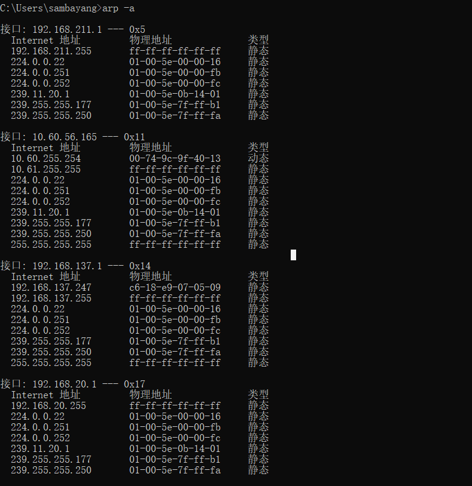

```
arp -d *
arp -a
```
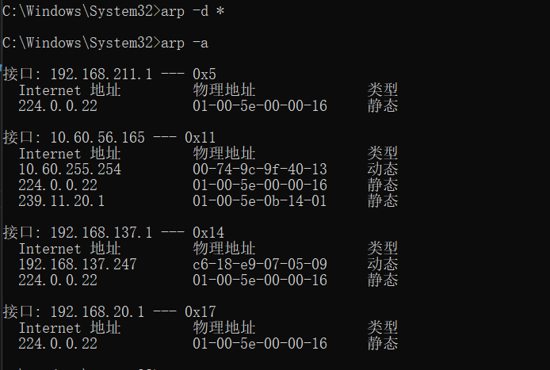
<mark>解释</mark>:清除的是arp缓存表。储存IP地址和MAC地址，是<IP地址，MAC地址>的对应表。

### $\color{orange}{2.实作2}$
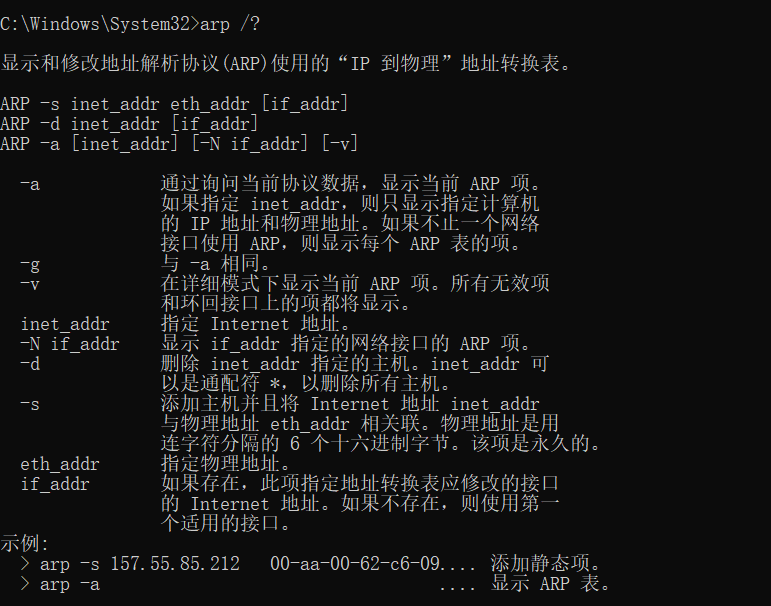

### $\color{orange}{3.实作3}$

当前网关的 IP 地址是 10.60.255.254，MAC 地址是 00-74-9c-9f-40-13，请使用命令设置其为静态类型的

### $\color{orange}{TroubleShooting}$:
 你可能会在实作三的操作中得到 "ARP 项添加失败: 请求的操作需要提升" 这样的信息，表示命令没能执行成功，你该如何解决？

>如果出现ARP 项添加失败: 请求的操作需要提升，<font color=blue>请使用管理员身份来运行</font>
>
>**问题**：在使用下列命令后你可能会出现无法将网关设置为静态
>```
>arp -s 10.60.255.254         00-74-9c-9f-40-13 
>```
>
>
><font color=pink>解决办法：</font>
>```
>netsh i i show in 
>netsh -c "i i" add neighbors 17 "10.60.255.254" >"00-74-9c-9f-40-13"
>arp -d 10.60.255.254
>```
>第一个是查看用的哪块网卡上的网,记录下Idx编号
>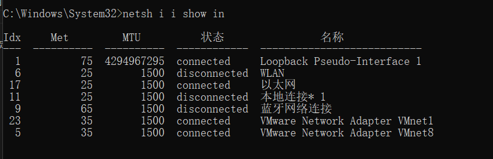
>
>第二个是添加arp静态绑定(需要管理员权限)
>
>第三个是删除绑定
>
>

成功之后可以看到
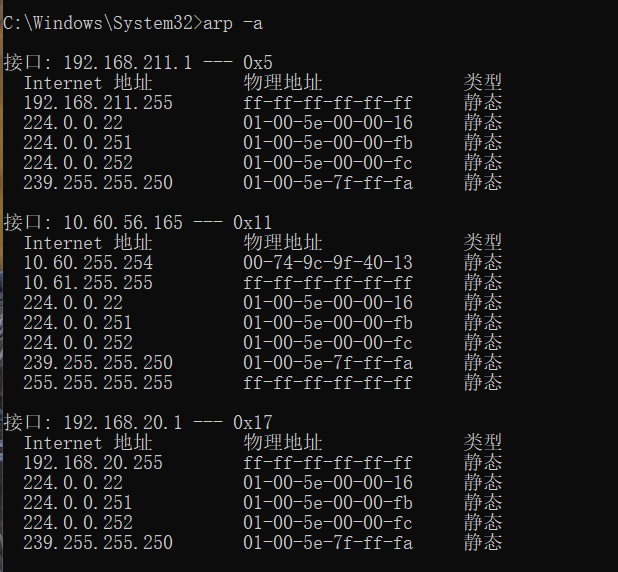
<mark>问题</mark> :  在实作三中，为何缓存中常常有网关的信息？
我们将网关或其它计算机的 arp 信息设置为静态有什么优缺点？

>缓存中是计算机曾经访问过的记录，访问其他地址需要网关信息，因此缓存中会存在网关的信息。
>
>静态的优缺点：
>
>**优点**：便于管理，可以免除在按用户方式计费时用户每次上网都必须进行的身份认证的繁琐过程。
>
>**缺点**：有安全隐患，合法用户分配的地址可能被非法盗用，容易给合法用户造成损失和潜在的安全隐患。
>
---
## 五.DHCP
DHCP（Dynamic Host Configuration Protocol）即动态主机配置协议，是一个用于 IP 网络的网络协议，位于 OSI 模型的应用层，使用 UDP 协议工作，主要有两个用途：
>
>用于内部网或网络服务供应商自动分配 IP 地址给用户
>
>用于内部网管理员对所有电脑作中央管理

简单的说，DHCP 可以让计算机自动获取/释放网络配置。
### $\color{orange}{1.实作1}$
一般地，我们自动获取的网络配置信息包括：IP 地址、子网掩码、网关 IP 以及 DNS 服务器 IP 等。
使用 ipconfig/release 命令释放自动获取的网络配置，并用 ipconfig/renew 命令重新获取，了解 DHCP 工作过程和原理。
```
1. ipconfig/release
```
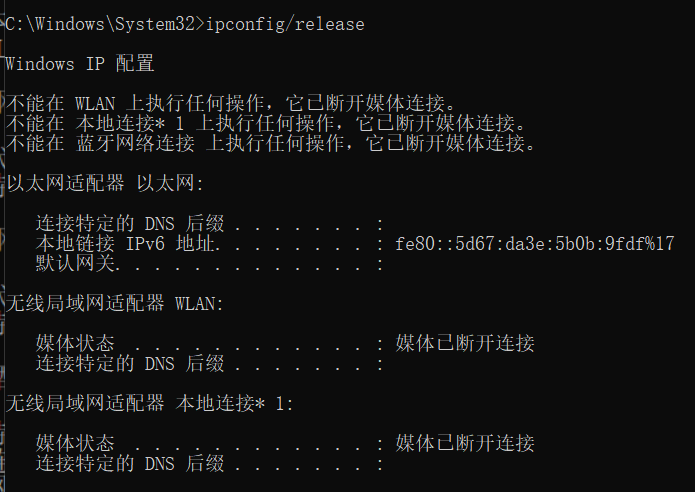
```
2. ipconfig/renew
```
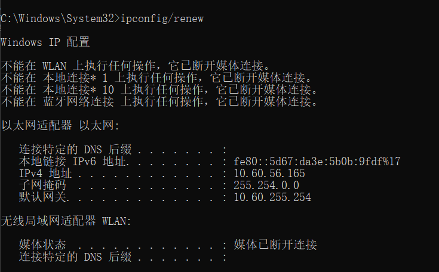

<mark>问题：</mark>在Windows系统下，如果由于某种原因计算机不能获取 DHCP 服务器的配置数据，那么Windows将会根据某种算法自动配置为 169.254.x.x 这样的 IP 地址。显然，这样的 IP 以及相关的配置信息是不能让我们真正接入 Internet 的，为什么？既然不能接入 Internet，那么Winodws系统采用这样的方案有什么意义？

>Windows操作系统为了防止主机脱网，为网卡设置169.254.x.x的自动私有IP地址。。该IP地址只是短暂性的解决计算机不能获取 DHCP 服务器的配置数据的问题，并不能真正接入Internet。Winodws系统采用这种方案可以使局域网内的电脑就可以通过这个IP来相互通讯，也防止ip冲突。

### $\color{orange}{TroubleShooting}$:
如果你没能成功的释放，请思考有哪些可能的原因并着手进行解决？

>**原因：** 可能没有开启DHCP客户端服务；也有可能出在了租约期限上，设置时应该减少租约时长。
>
>**解决办法**：如果没有开启DHCP服务的话，在 “ 运行 ” 中输入 “ sc config DHCP start= AUTO ” 重启后就行了

---
## 六.netstat

### $\color{orange}{1.实作1}$
Windows 系统将一些常用的端口与服务记录在
 <font color=pink>C:\WINDOWS\system32\drivers\etc\services</font> 文件中，请查看该文件了解常用的端口号分配。

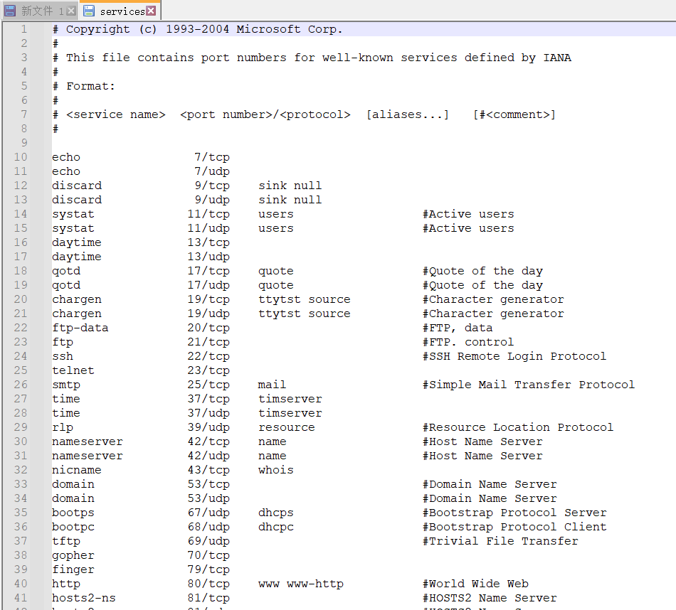

### $\color{orange}{2.实作2}$
使用 netstat -an 命令，查看计算机当前的网络连接状况。更多的 netstat 命令选项，可参考上面链接 4 和 5 。
```
netstat -an
```
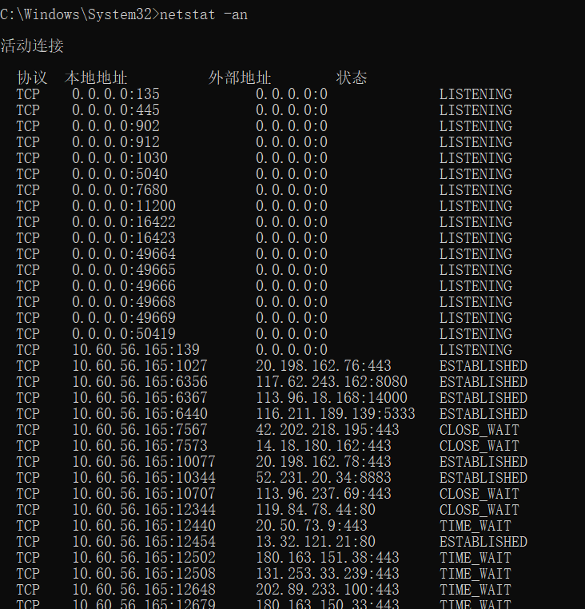

## 七.DNS

<font color="pink">DNS（Domain Name System）</font>即域名系统，是互联网的一项服务。它作为将域名和 IP 地址相互映射的一个分布式数据库，能够使人更方便地访问互联网。DNS 使用 TCP 和 UDP 的 53 号端口。

### $\color{orange}{1.实作1}$
Windows 系统将一些固定的/静态的 DNS 信息记录在<font color="pink">C:\WINDOWS\system32\drivers\etc\hosts </font>文件中，如我们常用的 localhost 就对应 127.0.0.1 。请查看该文件看看有什么记录在该文件中。

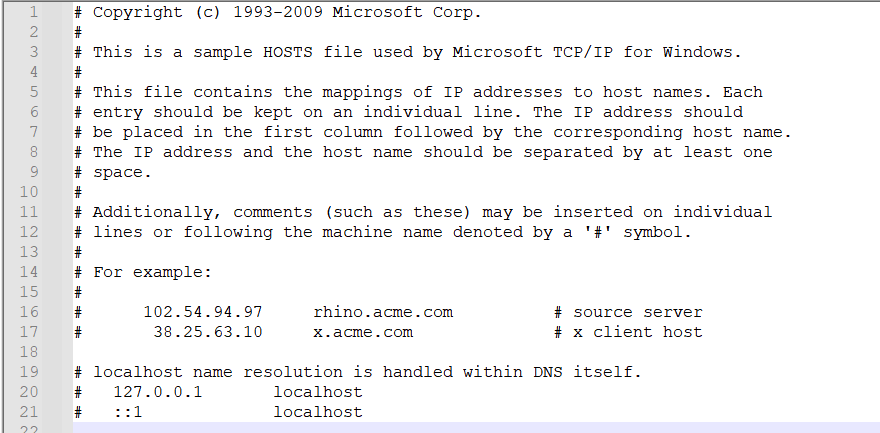

### $\color{orange}{2.实作2}$
解析过的 DNS 记录将会被缓存，以利于加快解析速度。请使用 ipconfig /displaydns 命令查看。我们也可以使用 ipconfig /flushdns 命令来清除所有的 DNS 缓存。
```
ipconfig /displaydns
```
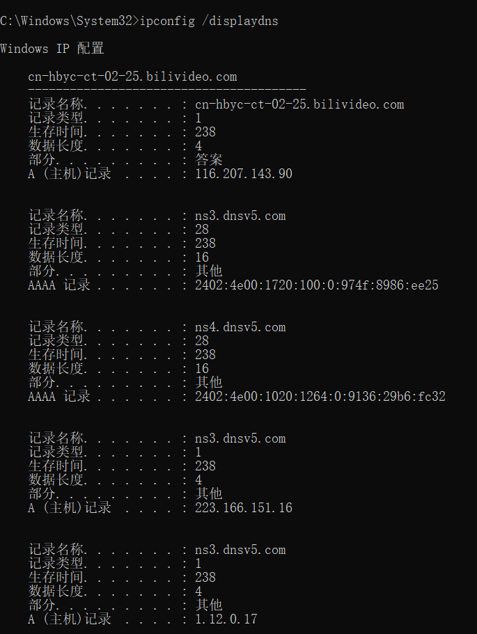

```
ipconfig /flushdns
```
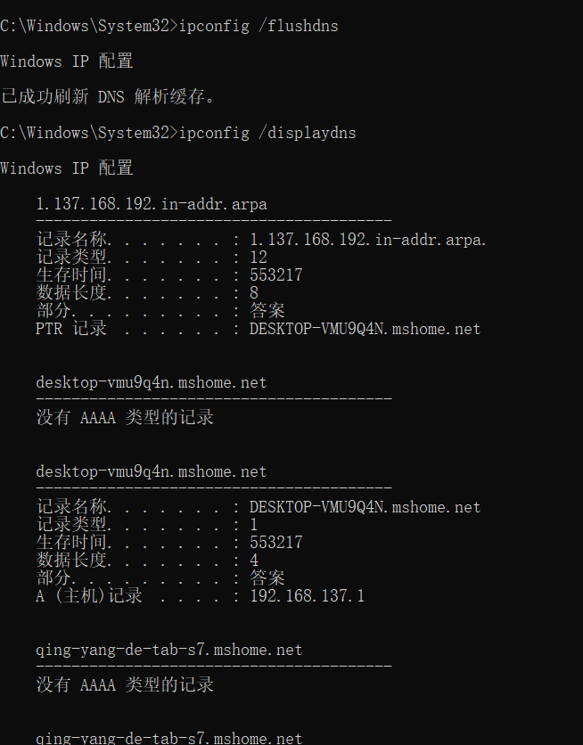

### $\color{orange}{3.实作3}$

使用 <font color="pink">nslookup qige.io </font>命令，将使用默认的 DNS 服务器查询该域名。当然你也可以指定使用 CloudFlare（1.1.1.1）或 Google（8.8.8.8） 的全球 DNS 服务器来解析，如：nslookup qige.io 8.8.8.8，当然，由于你懂的原因，这不一定会得到正确的答案。

```
nslookup qige.io
```
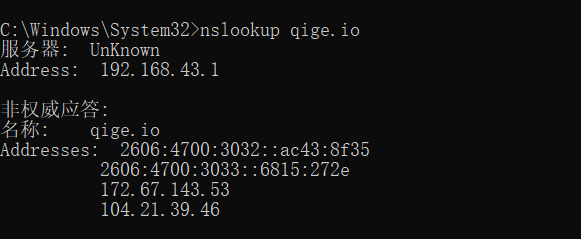

```
nslookup qige.io 8.8.8.8
```
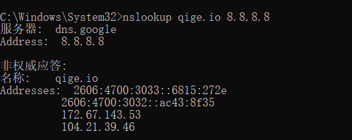
### $\color{orange}{TroubleShooting}$:
上面秘籍中我们提到了使用插件或自己修改 hosts 文件来屏蔽广告，思考一下这种方式为何能过滤广告？如果某些广告拦截失效，那么是什么原因？你应该怎样进行分析从而能够成功屏蔽它？

> **插件过滤广告的原因：** 通过插件了解到你访问网页的URL，然后把广告URL的请求组织了
>
>**为什么能屏蔽广告：** 修改hosts文件将某个网站重定向到一个地址，使之无法访问达到屏蔽广告的效果
>
>**某些广告拦截失败原因：** 广告是专门放在了网页里面
>
>**分析：** 利用 Hosts 的高优先级，将错误的「IP 地址」与域名绑定，就实现了屏蔽某些服务器的效果。


## 八.cache

cache 即缓存，是 IT 领域一个重要的技术。我们此处提到的 cache 主要是**浏览器缓存**。

浏览器缓存是根据 HTTP 报文的缓存标识进行的，是性能优化中简单高效的一种优化方式了。一个优秀的缓存策略可以缩短网页请求资源的距离，减少延迟，并且由于缓存文件可以重复利用，还可以减少带宽，降低网络负荷。
### $\color{orange}{1.实作1}$
打开 Chrome 或 Firefox 浏览器，访问 https://qige.io ，接下来 <font color="pink">敲 F12 键 或 Ctrl + Shift + I </font>组合键打开开发者工具，选择 <font color="pink">Network</font> 面板后刷新页面，你会在开发者工具底部看到加载该页面花费的时间。请进一步查看哪些文件被 cache了，哪些没有。

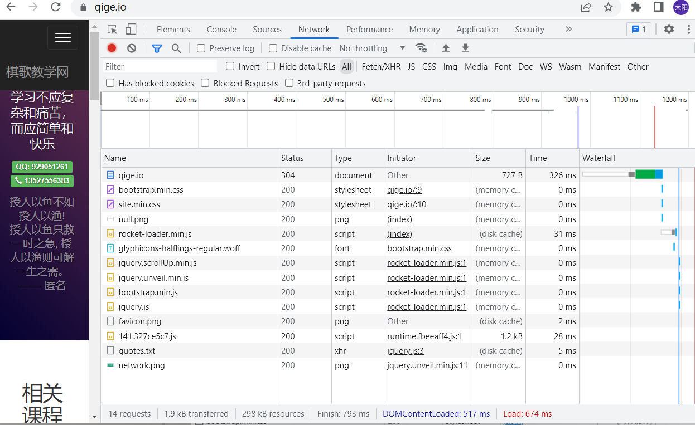

### $\color{orange}{2.实作2}$
接下来仍在 Network 面板，选择 <font color="pink">Disable cache</font>  选项框，表明当前不使用 cache，页面数据全部来自于 Internet，刷新页面，再次在开发者工具底部查看加载该页面花费的时间。你可比对与有 cache 时的加载速度差异。

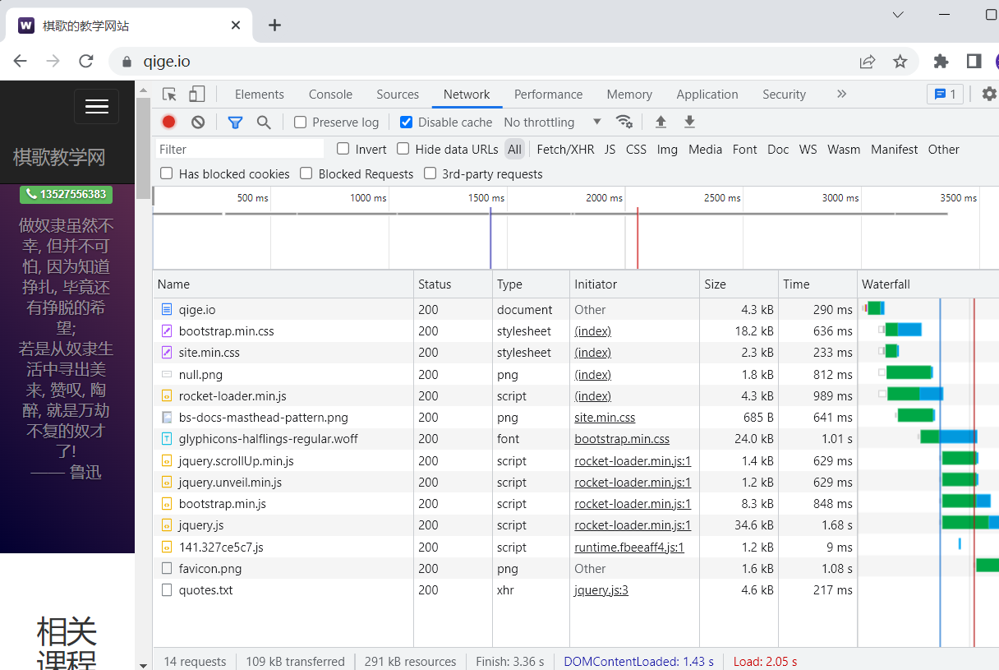

<mark>加载速度差异：</mark>有cache是674 ms，没有cache是2.05s