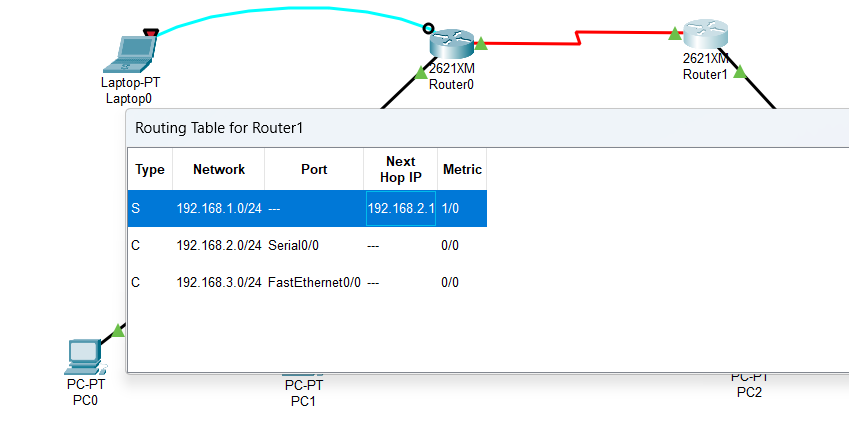

# Cisco Packet Tracer 实验

## 一. 直接连接两台 PC 构建 LAN
将两台 PC 直接连接构成一个网络。注意：直接连接需使用交叉线。
  
进行两台 PC 的基本网络配置，只需要配置 IP 地址即可，然后相互 ping 通即成功。


## 二.用交换机构建 LAN

各PC的基本网络配置如下表：

|机器名|IP|子网掩码|
|------|--------|------|
|PC0|192.168.1.1|255.255.255.0|
|PC1|192.168.1.2|255.255.255.0|
|PC2|192.168.2.1|255.255.255.0|
|PC3|192.168.2.2|255.255.255.0|


>✎ 问题
>
>1. PC0 能否 ping 通 PC1、PC2、PC3 ？
>
>2. PC3 能否 ping 通 PC0、PC1、PC2 ？为什么？
>
>3. 将 4 台 PC 的掩码都改为 255.255.0.0 ，它们相互能 ping 通吗？为什么？
>
>4. 使用二层交换机连接的网络需要配置网关吗？为什么？

<font color="green">答：</font>

1. PC0可以ping通PC1，但不能ping通PC2，PC3
   


2. PC3可以ping通PC2，但不能ping通PC0，PC1
   


3. 可以ping通(用PC0 `ping` PC2,PC3)。因为将子网掩码改了之后，四个主机的网络号一样（192.168.0.0），处于同一子网中
   
   

4. 不用配置网关，因为在网关内进行通信。


>✎ 试一试
>
>集线器 Hub 是工作在物理层的多接口设备，它与交换机的区别是什么？请
在 CPT 软件中用 Hub 构建网络进行实际验证。


`区别：`集线器是以广播的方式传送数据；而交换机是在表内找到对应的mac地址后进行数据传输，如果交换机没有找到就会先进行广播。

## 三.交换机接口地址列表
二层交换机是一种即插即用的多接口设备，它对于收到的帧有 3 种处理方式：广播、转发和丢弃（请弄清楚何时进行何种操作）。那么，要转发成功，则交换机中必须要有接口地址列表即 MAC 表，该表是交换机通过学习自动得到的！

仍然构建上图的拓扑结构，并配置各计算机的 IP 在同一个一个子网，使用工具栏中的放大镜点击某交换机如左边的 Switch3，选择 MAC Table，可以看到最初交换机的 MAC 表是空的，也即它不知道该怎样转发帧（那么它将如何处理？），用 PC0 访问（ping）PC1 后，再查看该交换机的 MAC 表，现在有相应的记录，请思考如何得来。随着网络通信的增加，各交换机都将生成自己完整的 MAC 表，此时交换机的交换速度就是最快的！

`最初的MAC表`

 

`PC0访问PC1后：`

 
  

  ## 四.生成树协议（Spanning Tree Protocol）
交换机在目的地址未知或接收到广播帧时是要进行广播的。如果交换机之间存在回路/环路，那么就会产生广播循环风暴，从而严重影响网络性能。

而交换机中运行的 STP 协议能避免交换机之间发生广播循环风暴。


这是初始时的状态。我们可以看到交换机之间有回路，这会造成广播帧循环传送即形成广播风暴，严重影响网络性能。

随后，交换机将自动通过生成树协议（STP）对多余的线路进行自动阻塞（Blocking），以形成一棵以 Switch1 为根（具体哪个是根交换机有相关的策略）的具有唯一路径树即生成树！

经过一段时间，随着 STP 协议成功构建了生成树后，Switch0 的两个接口当前物理上是连接的，但逻辑上是不通的，处于Blocking状态（桔色）如下图所示：


在网络运行期间，假设某个时候 Switch0 与 Switch1 之间的物理连接出现问题（将 Switch0 与 Switch1 的连线剪掉），则该生成树将自动发生变化。Switch0 上方先前 Blocking 的那个接口现在活动了（绿色），但下方那个接口仍处于 Blocking 状态（桔色）。如下图所示：


>🗣 注意
>
>交换机的 STP 协议即生成树协议始终自动保证交换机之间不会出现回路，从而形成广播风暴。


## 五. 路由器配置初步
我们模拟重庆交通大学和重庆大学两个学校的连接，构建如下拓扑：


**说明一**

交通大学与重庆大学显然是两个不同的子网。在不同子网间通信需通过路由器。

路由器的每个接口下至少是一个子网，图中我们简单的规划了 3 个子网：

1. 左边路由器是交通大学的，其下使用交换机连接交通大学的网络，分配网络号 192.168.1.0/24，该路由器接口也是交通大学网络的网关，分配 IP 为 192.168.1.1
2. 右边路由器是重庆大学的，其下使用交换机连接重庆大学的网络，分配网络号 192.168.3.0/24，该路由器接口也是重庆大学网络的网关，分配 IP 为 192.168.3.1
3. 两个路由器之间使用广域网接口相连，也是一个子网，分配网络号 192.168.2.0/24

**说明二**
现实中，交通大学和重庆大学的连接是远程的。该连接要么通过路由器的光纤接口，要么通过广域网接口即所谓的 serial 口（如拓扑图所示）进行，一般不会通过双绞线连接（为什么？）。

`答：`双绞线传输距离较短，为100m，且中间需要连接交换机


下面我们以通过路由器的广域网口连接为例来进行相关配置。请注意：我们选用的路由器默认没有广域网模块（名称为 WIC-1T 等），需要关闭路由器后添加，然后再开机启动。

**说明三**
在模拟的广域网连接中需注意 DCE 和 DTE 端（连线时线路上有提示，带一个时钟标志的是 DCE 端。有关 DCE 和 DTE 的概念请查阅相关资料。），在 DCE 端需配置时钟频率 64000


**说明四**
路由器有多种命令行配置模式，每种模式对应不同的提示符及相应的权限。

请留意在正确的模式下输入配置相关的命令。

>User mode：用户模式
>
>Privileged mode：特权模式
>
>Global configuration mode：全局配置模式
>
>Interface mode：接口配置模式
>
>Subinterface mode：子接口配置模式

**说明五**

在现实中，对新的路由器，显然不能远程进行配置，我们必须在现场通过笔记本的串口与路由器的 console 接口连接并进行初次的配置（注意设置比特率为9600）后，才能通过网络远程进行配置。这也是上图左上画出笔记本连接的用意。

**说明六**

在路由器的 CLI 界面中，可看到路由器刚启动成功后，因为无任何配置，将会提示是否进行对话配置（Would you like to enter the initial configuration dialog?），因其步骤繁多，请选择 NO

拓扑图中路由器各接口配置数据如下：

|接口名|IP|子网掩码|
|----------------------|------|-----|
交通大学 Router2 以太网口|192.168.1.1|255.255.255.0|
|交通大学 Router2 广域网口|192.168.2.1|255.255.255.0|
|重庆大学 Router3 以太网口|192.168.3.1|255.255.255.0|
|重庆大学 Router3 广域网口|192.168.2.2|255.255.255.0|

拓扑图中各 PC 配置数据如下：

|节点名|IP|子网掩码|网关|
|------|---|---|---|
|交通大学 PC0|192.168.1.2|255.255.255.0|192.168.1.1|
|交通大学 PC1|192.168.1.3|255.255.255.0|192.168.1.1|
|重庆大学 PC2|192.168.3.2|255.255.255.0|192.168.3.1|
|重庆大学 PC3|192.168.3.3|255.255.255.0|192.168.3.1|

交通大学路由器基本配置如下：

以太网口：

```
Router>enable   // 从普通模式进入特权模式
Router#configure terminal   // 进入全局配置模式
Router(config)#interface f0/0   // 进入配置以太网口模式
Router(config-if)#ip address 192.168.1.1 255.255.255.0   // 配置该接口的 IP
Router(config-if)#no shutdown   // 激活接口
Router(config-if)#^z   // 直接退到特权模式
Router#
```
广域网口：

```
Router>en   // 从普通模式进入特权模式
Router#conf t   // 进入全局配置模式
Router(config)#int s0/0   // 进入配置广域网口模式
Router(config-if)#ip address 192.168.2.1 255.255.255.0   //配置该接口的 IP
Router(config-if)#clock rate 64000    // 其为 DCE 端，配置时钟频率
Router(config-if)#no shutdown   // 激活接口
Router(config-if)#^z   // 直接退到特权模式
Router#
```
重庆大学路由器基本配置如下：

以太网口：
```
Router>en   // 从普通模式进入特权模式
Router#conf t   // 进入全局配置模式
Router(config)#int f0/0   // 进入配置以太网口模式
Router(config-if)#ip address 192.168.3.1 255.255.255.0   // 配置该接口的 IP
Router(config-if)#no shutdown   // 激活接口
Router(config-if)#^z   // 直接退到特权模式
Router#
```

广域网口：

```
Router>en   // 从普通模式进入特权模式
Router#conf t   // 进入全局配置模式
Router(config)#int s0/0   // 进入配置广域网口模式
Router(config-if)#ip address 192.168.2.2 255.255.255.0   //配置该接口的 IP
Router(config-if)#no shutdown   // 激活接口
Router(config-if)#^z   // 直接退到特权模式
Router#
```
至此，路由器基本的配置完成。请按照上面 PC 配置表继续配置各个 PC 。


`各个配置完成后`


>✎ 问题
>
>现在交通大学内的各 PC 及网关相互能 ping 通，重庆大学也类似。但不能从交大的 PC ping 通重大的 PC，反之亦然，也即不能跨子网。为什么？


<font color="green">答：</font>
广播消息只能在同一个子网中传播，无法在不同子网传播。重交和重大服务器不在同一个子网中，所以不能互相ping通。


## 六. 静态路由
静态路由是非自适应性路由协议，是由网络管理人员手动配置的，不能够根据网络拓扑的变化而改变。 因此，静态路由简单高效，适用于结构非常简单的网络。

在当前这个简单的拓扑结构中我们可以使用静态路由，即直接告诉路由器到某网络该怎么走即可。

在前述路由器基本配置成功的情况下使用以下命令进行静态路由协议的配置：

交通大学路由器静态路由配置：
```
Router>en   // 从普通模式进入特权模式
Router#conf t   // 进入全局配置模式
Router(config)#ip route 192.168.3.0 255.255.255.0 192.168.2.2   // 告诉交通大学路由器到 192.168.3.0 这个网络的下一跳是 192.168.2.2
Router(config)#exit   //退到特权模式
Router#show ip route    //查看路由表
```


重庆大学路由器静态路由配置：
```
Router>en   // 从普通模式进入特权模式
Router#conf t   // 进入全局配置模式
Router(config)#ip route 192.168.1.0 255.255.255.0 192.168.2.1   // 告诉重庆大学路由器到 192.168.1.0 这个网络的下一跳是 192.168.2.1
Router(config)#exit   //退到特权模式
Router#show ip route    //查看路由表
```


查看路由表你可看到标记为 S 的一条路由，S 表示 Static 。

至此，这些 PC 能全部相互 ping 通！

>🗣 注意
>
>我们的拓扑只模拟了 3 个网络。在现实中，路由器连接的网络数量非常多，我们还需要配置一条缺省路由，否则其它网络皆不能到达！当然，我们的拓扑可以不考虑。
>
>Router(config)#ip route 0.0.0.0 0.0.0.0 *.*.*.* // 缺省全部转发给 *.*.*.* 这个IP

## 七.动态路由 RIP
动态路由协议采用自适应路由算法，能够根据网络拓扑的变化而重新计算机最佳路由。

RIP 的全称是 Routing Information Protocol，是距离矢量路由的代表（目前虽然淘汰，但可作为我们学习的对象）。使用 RIP 协议只需要告诉路由器直接相连有哪些网络即可，然后 RIP 根据算法自动构建出路由表。

因为我们模拟的网络非常简单，因此不能同时使用静态和动态路由，否则看不出效果，所以我们需要把刚才配置的静态路由先清除掉。

清除静态路由配置：
1. 直接关闭路由器电源。相当于没有保存任何配置，然后各接口再按照前面基本配置所述重新配置 IP 等参数（推荐此方法，可以再熟悉一下接口的配置命令）；

2. 使用 no 命令清除静态路由。在全局配置模式下，交通大学路由器使用：no ip route 192.168.3.0 255.255.255.0 192.168.2.2，重庆大学路由器使用：no ip route 192.168.1.0 255.255.255.0 192.168.2.1 。相当于使用 no 命令把刚才配置的静态路由命令给取消。


交通大学路由器 RIP 路由配置：
```
Router>en   // 从普通模式进入特权模式
Router#conf t   // 进入全局配置模式
Router(config)#router rip   // 启用 RIP 路由协议，注意是 router 命令
Router(config-router)#network 192.168.1.0   // 网络 192.168.1.0 与我直连
Router(config-router)#network 192.168.2.0   // 网络 192.168.2.0 与我直连
Router(config-router)#^z   //直接退到特权模式
Router#show ip route    //查看路由表
```


重庆大学路由器 RIP 路由配置：
```
Router>en   // 从普通模式进入特权模式
Router#conf t   // 进入全局配置模式
Router(config)#router rip   // 启用RIP路由协议，注意是 router 命令
Router(config-router)#network 192.168.3.0   // 网络 192.168.3.0 与我直连
Router(config-router)#network 192.168.2.0   // 网络 192.168.2.0 与我直连
Router(config-router)#^z   //直接退到特权模式
Router#show ip route    //查看路由表
```


查看路由表你可看到标记为 R 的一条路由，R 表示 RIP 。

至此，这些 PC 也能全部相互 ping 通！

# 八.动态路由 OSPF
OSPF（Open Shortest Path First 开放式最短路径优先）是一个内部网关协议（Interior Gateway Protocol，简称 IGP）， 用于在单一自治系统（Autonomous System，AS）内决策路由。OSPF 性能优于 RIP，是当前域内路由广泛使用的路由协议。

同样的，我们需要把刚才配置的 RIP 路由先清除掉。

清除 RIP 路由配置：
1. 直接关闭路由器电源。相当于没有保存任何配置，然后各接口再按照前面基本配置所述重新配置 IP 等参数

2. 使用 no 命令清除 RIP 路由。在全局配置模式下，各路由器都使用：no router rip 命令进行清除

交通大学路由器 OSPF 路由配置：
```
Router>en   // 从普通模式进入特权模式
Router#conf t   // 进入全局配置模式
Router(config)#router ospf 1   // 启用 OSPF 路由协议，进程号为1（可暂不理会进程号概念）
Router(config-router)#network 192.168.1.0 0.0.0.255 area 0   // 自治域0中的属于 192.168.1.0/24 网络的所有主机（反向掩码）参与 OSPF
Router(config-router)#network 192.168.2.0 0.0.0.255 area 0   // 自治域0中的属于 192.168.2.0/24 网络的所有主机（反向掩码）参与 OSPF
Router(config-router)#^z   //直接退到特权模式
Router#show ip route    //查看路由表
```


重庆大学路由器 OSPF 路由配置：

```
Router>en   // 从普通模式进入特权模式
Router#conf t   // 进入全局配置模式
Router(config)#router ospf 1   // 启用 OSPF 路由协议，进程号为1
Router(config-router)#network 192.168.3.0 0.0.0.255 area 0   // 自治域0中的属于 192.168.3.0/24 网络的所有主机（反向掩码）参与 OSPF
Router(config-router)#network 192.168.2.0 0.0.0.255 area 0   // 自治域0中的属于 192.168.2.0/24 网络的所有主机（反向掩码）参与 OSPF
Router(config-router)#^z   //直接退到特权模式
Router#show ip route    //查看路由表
```


查看路由表你可看到标记为 O 的一条路由，O 表示 OSPF 。

至此，这些 PC 能全部相互 ping 通！

>🗣 反向掩码
>
>我们常见的子网掩码是所谓的正向掩码，用连续的 1 和 0 来表示，其中 1 表示需精确匹配， 0 则无需，以此得到网络号。
>
>类似的，反向掩码也使用连续的 1 和 0 来表示，但相反，其中 0 表示需精确匹配， 1 则无需，以此得到相关的 IP，主要用于 OSPF 中。
>
>还有一个通配符掩码，也采用与反向掩码相似的规则，主要用于访问控制列表 ACL 中。

## 九.基于端口的网络地址翻译 PAT
网络地址转换（NAT，Network Address Translation）被各个 Internet 服务商即 ISP 广泛应用于它们的网络中，也包括 WiFi 网络。 原因很简单，NAT 不仅完美地解决了 lP 地址不足的问题，而且还能够有效地避免来自网络外部的攻击，隐藏并保护网络内部的计算机。

>NAT 的实现方式一般有三种：
>
>静态转换： Static NAT
>
>动态转换： Dynamic NAT
>
>端口多路复用： OverLoad

端口多路复用使用最多也最灵活。OverLoad 是指不仅改变发向 Internet 数据包的源 IP 地址，同时还改变其源端口，即进行了端口地址转换（PAT，Port Address Translation）。

采用端口多路复用方式，内部网络的所有主机均可共享一个合法外部 IP 地址实现对 Internet 的访问，从而可以最大限度地节约IP地址资源。 同时，又可隐藏网络内部的所有主机，有效避免来自 Internet 的攻击。因此，目前网络中应用最多的就是端口多路复用方式。

我们仍然使用重庆交通大学和重庆大学两个学校的拓扑进行 PAT 实验。我们需要保证两个学校的路由已经配置成功，无论使用静态路由还是动态路由，以下我们给出完整的配置过程：设定这两个学校的路由器使用 OSPF 协议，模拟交通大学使用内部 IP 地址（192.168.1.0/24），模拟重庆大学使用外部 IP 地址（8.8.8.0/24），两个路由器之间使用外部 IP 地址（202.202.240.0/24），在交通大学的出口位置即广域网口实施 PAT。

拓扑图中各 PC 配置数据如下：

|节点名|IP|子网掩码|网关|
|------|---|----|------|
|交通大学 PC0|192.168.1.2|255.255.255.0|192.168.1.1|
|交通大学 PC1|192.168.1.3|255.255.255.0|192.168.1.1|
|重庆大学 PC2|8.8.8.2|255.255.255.0|8.8.8.1|
|重庆大学 PC3|8.8.8.3|255.255.255.0|8.8.8.1|


拓扑图中路由器各接口配置数据如下：

|节点名|IP|子网掩码
|------|---|----|
|交通大学 Router2 以太网口|192.168.1.1|255.255.255.0|
|交通大学 Router2 广域网口|202.202.240.1|255.255.255.0|
|重庆大学 Router3 以太网口|8.8.8.1|255.255.255.0|
|重庆大学 Router3 广域网口|202.202.240.2|255.255.255.0|

交通大学路由器接口配置如下：

以太网口：
```
Router>en   // 从普通模式进入特权模式
Router#conf t   // 进入全局配置模式
Router(config)#int f0/0   // 进入配置以太网口模式
Router(config-if)#ip address 192.168.1.1 255.255.255.0   // 配置 IP
Router(config-if)#no shutdown   // 激活接口
```

广域网口：
```
Router>en   // 从普通模式进入特权模式
Router#conf t   // 进入全局配置模式
Router(config)#int s0/0   // 进入配置广域网口模式
Router(config-if)#ip address 202.202.240.1 255.255.255.0   //配置 IP
Router(config-if)#clock rate 64000    // 其为 DCE 端，配置时钟频率
Router(config-if)#no shutdown   // 激活接口
```
重庆大学路由器接口配置如下：

以太网口：
```
Router>en   // 从普通模式进入特权模式
Router#conf t   // 进入全局配置模式
Router(config)#int f0/0   // 进入配置以太网口模式
Router(config-if)#ip address 8.8.8.1 255.255.255.0   // 配置 IP
Router(config-if)#no shutdown   // 激活接口
```

广域网口：

```
Router>en   // 从普通模式进入特权模式
Router#conf t   // 进入全局配置模式
Router(config)#int s0/0   // 进入配置广域网口模式
Router(config-if)#ip address 202.202.240.2 255.255.255.0   // 配置 IP
Router(config-if)#no shutdown   // 激活接口
```

交通大学路由器 OSPF 路由配置：
```
Router>en   // 从普通模式进入特权模式
Router#conf t   // 进入全局配置模式
Router(config)#router ospf 1   // 启用 OSPF 路由协议，进程号为1（可暂不理会进程号概念）
Router(config-router)#network 192.168.1.0 0.0.0.255 area 0   // 自治域0中的属于192.168.1.0/24网络的所有主机（反向掩码）参与 OSPF
Router(config-router)#network 202.202.240.0 0.0.0.255 area 0   // 自治域0中的属于202.202.240.0/24网络的所有主机（反向掩码）参与 OSPF
```


重庆大学路由器 OSPF 路由配置：
```
Router>en   // 从普通模式进入特权模式
Router#conf t   // 进入全局配置模式
Router(config)#router ospf 1   // 启用 OSPF 路由协议，进程号为1
Router(config-router)#network 202.202.240.0 0.0.0.255 area 0   // 自治域0中的属于202.202.240.0/24网络的所有主机（反向掩码）参与 OSPF
Router(config-router)#network 8.8.8.0 0.0.0.255 area 0   // 自治域0中的属于8.8.8.0/24网络的所有主机
```


此时，这些 PC 能全部相互 ping 通！如在交通大学内部使用 PC0（192.168.1.2）来 ping 重庆大学的PC2（8.8.8.2）应该成功。


下面我们将重庆大学的路由器看着 Internet 中的骨干路由器，那么这些路由器将不会转发内部/私有 IP 地址的包（直接丢弃）。我们通过在重庆大学路由器上实施访问控制 ACL ，即丢弃来自交通大学（私有 IP 地址）的包来模拟这个丢包的过程。

重庆大学路由器丢包的配置：
```
Router>en   // 从普通模式进入特权模式
Router#conf t   // 进入全局配置模式
Router(config)#access-list 1 deny 192.168.1.0 0.0.0.255  // 创建 ACL 1，丢弃/不转发来自 192.168.1.0/24 网络的所有包
Router(config)#access-list 1 permit any  // 添加 ACL 1 的规则，转发其它所有网络的包
Router(config)#int s0/0   // 配置广域网口
Router(config-if)#ip access-group 1 in  // 在广域网口上对进来的包
实施 ACL 1 中的规则，实际就是广域网口如果收到来自 192.168.1.0/24 IP的包即丢弃
```


此时，再使用交通大学内部的 PC0（192.168.1.2）来 ping 重庆大学的 PC2（8.8.8.2）就不成功了，会显示目的主机不可到达（Destination host unreachable）信息。


下面，我们就开始实施 PAT。即：我们将会在交通大学路由器的出口上将内部/私有 IP 地址转换为外部/公开 IP，从而包的源 IP 发生了改变，就不会被重庆大学路由器丢弃，因此网络连通。

交通大学路由器 PAT 配置：
```
Router>en   // 从普通模式进入特权模式
Router#conf t   // 进入全局配置模式
Router(config)#access-list 1 permit 192.168.1.0 0.0.0.255  // 创建 ACL 1，允许来自 192.168.1.0/24 网络的所有包
Router(config)#ip nat inside source list 1 interface s0/0 overload  // 来自于 ACL 中的 IP 将在广域网口实施 PAT
Router(config)#int f0/0   // 配置以太网口
Router(config-if)#ip nat inside   // 配置以太网口为 PAT 的内部
Router(config)#int s0/0   // 配置广域网口
Router(config-if)#ip nat outside   // 配置广域网口为 PAT 的外部
```


现在，再次使用交通大学内部的 PC0（192.168.1.2）来 ping 重庆大学的PC2（8.8.8.2）则OK。


## 十. 虚拟局域网 VLAN
在实际网络中，你可看到路由器一般位于网络的边界，而内部几乎全部使用交换机连接。

前面我们分析过，交换机连接的是同一个子网！ 显然，在这样一个大型规模的子网中进行广播甚至产生广播风暴将严重影响网络性能甚至瘫痪。

另外我们也已经知道，其实学校是划分了 N 多个子网的，那么这些交换机连接的就绝不是一个子网！这样矛盾的事情该如何解释呢？我们实际上使用了支持 VLAN 的交换机！而前述的交换机只是普通的 2 层交换机（或者我们把它当作 2 层交换机在使用。

VLAN（Virtual Local Area Network）即虚拟局域网。通过划分 VLAN，我们可以把一个物理网络划分为多个逻辑网段即多个子网。

划分 VLAN 后可以杜绝网络广播风暴，增强网络的安全性，便于进行统一管理等。

在 CPT 中构建如下图所示拓扑：


Cisco 2960 交换机是支持 VLAN 的交换机，共有 24 个 100M 和 2 个 1000M 以太网口。默认所有的接口都在 VLAN 1 中，故此时连接上来的计算机都处于同一 VLAN，可以进行通信。

下面我们就该交换机的 24 个 100M 接口分为 3 个部分，划分到 3 个不同的 VLAN 中，id 号分别设为 10、20、30，且设置别名（computer、communication、electronic）以利于区分和管理。

交换机 VLAN 配置：
```
Switch>en
Switch#conf t
Switch(config)#vlan 10    // 创建 id 为 10 的 VLAN（缺省的，交换机所有接口都属于VLAN 1，不能使用）
Switch(config-vlan)#name computer    // 设置 VLAN 的别名
Switch(config-vlan)#exit
Switch(config)#int vlan 10    // 该 VLAN 为一个子网，设置其 IP，作为该子网网关
Switch(config-if)#ip address 192.168.0.1 255.255.255.0
Switch(config-if)#exit
Switch(config)#vlan 20    // 创建 id 为 20 的 VLAN
Switch(config-vlan)#name communication    //设置别名
Switch(config-vlan)#exit
Switch(config)#int vlan 20
Switch(config-if)#ip addr 192.168.1.1 255.255.255.0
Switch(config-if)#exit
Switch(config)#vlan 30    // 创建 id 为 20 的 VLAN
Switch(config-vlan)#name electronic    // 设置别名
Switch(config-vlan)#exit
Switch(config)#int vlan 30
Switch(config-if)#ip add 192.168.2.1 255.255.255.0
Switch(config-if)#exit
Switch(config)#int range f0/1-8    // 成组配置接口（1-8）
Switch(config-if-range)#switchport mode access    // 设置为存取模式
Switch(config-if-range)#switchport access vlan 10    // 划归到 VLAN 10 中
Switch(config-if-range)#exit
Switch(config)#int range f0/9-16
Switch(config-if-range)#switchport mode access
Switch(config-if-range)#switchport access vlan 20
Switch(config-if-range)#exit
Switch(config)#int range f0/17-24
Switch(config-if-range)#switchport mode access
Switch(config-if-range)#switchport access vlan 30
Switch(config-if-range)#^Z
Switch#show vlan // 查看 VLAN 的划分情况
```

至此，在该交换机上我们就划分了 3 个 VLAN（不包括缺省的 VLAN 1）。


各 VLAN 下 PC 的网络配置及连接的交换机接口如下表：

|机器名|连接的接口|所属VLAN|IP|子网掩码|网关|
|---|---|---|---|---|---|
|PC0|F0/1|VLAN 10|192.168.0.2|255.255.255.0|192.168.0.1|
|PC1|F0/2|VLAN 10|192.168.0.3|255.255.255.0|192.168.0.1|
|PC2|F0/17|VLAN 30|192.168.2.2|255.255.255.0|192.168.2.1|
|PC3|F0/9|VLAN 20|192.168.1.2|255.255.255.0|192.168.1.1|
|PC4|F0/10|VLAN 20|192.168.1.3|255.255.255.0|192.168.1.1|
|PC5|F0/18|VLAN 30|192.168.2.3|255.255.255.0|192.168.2.1|
|PC6|F0/19|VLAN 30|192.168.2.4|255.255.255.0|192.168.2.1|

此时可以使用 ping 命令进行测试，你会发现只有在同一 VLAN 中的 PC 才能通信，且广播也局限于该 VLAN。


>✎ 思考
>
>分析一下当前为何不同 VLAN 中的 PC 不能通信？网关在此起什么作用？我们的网关又在何处？如何发起广播测试？

同一个VLAN的主机可以直接通信，不同的VLAN中的主机则需要路由器进行路由才能通信。网关是每个VLAN的进出口处于路由器的位置。广播测试只能在某一VLAN中进行。


## 十一.虚拟局域网管理 VTP
前一个实验我们在交换机上进行了 VLAN 的规划和划分。但在实际应用中，我们绝不允许在这些支持VLAN的交换机上进行随意的 VLAN 划分，如此将造成管理混乱！VLAN的划分必须得到统一的规划和管理，这就需要 VTP 协议。

VTP（VLAN Trunk Protocol）即 VLAN 中继协议。VTP 通过 ISL 帧或 Cisco 私有 DTP 帧（可查阅相关资料了解）保持 VLAN 配置统一性，也被称为虚拟局域网干道协议，它是思科私有协议。 VTP 统一管理、增加、删除、调整VLAN，自动地将信息向网络中其它的交换机广播。

此外，VTP 减小了那些可能导致安全问题的配置，只要在 VTP Server 做相应设置，VTP Client 会自动学习 VTP Server 上的 VLAN 信息。

为演示 VTP，重新构建如下拓扑结构：


>🗣 注意：
>
>作为干线，两个 2960 交换机和核心的 3560 交换机应该使用 Gbit 口相连。这虽然不是必须，但现实中这样连接性能最好。
>
>3560 交换机是网络中的核心交换机，我们将其作为 VTP Server，VTP 域及 VLAN 将在其上创建和管理。
>
>两个 2960 交换机是是局域网中的汇聚层/接入层交换机，将作为 VTP Client，可决定加入的 VTP 域和 VLAN。

目前该网络都属于 VLAN 1，也即这些 PC 是可以相互通信的。前面说过，无论对于性能、管理还是安全等而言，现实中我们必须进行 VLAN 划分。

现在我们的要求是：新建两个 VLAN，然后让 PC0 和 PC1 属于 VLAN 2，PC1 和 PC3 属于 VLAN 3。

我们将在核心交换机 3560上进行如下工作：

1. 设置为 server 模式，VTP 域为 cqjtu
2. 新建 VLAN 2，网络号 192.168.1.0/24，网关 192.168.1.1
3. 新建 VLAN 3，网络号 192.168.2.0/24，网关 192.168.2.1
   
3560 VTP Server 配置：
```
Switch>en
Switch#conf t
Switch(config)#hostname 3560    // 更改交换机名称（可选）
3560(config)#vtp domain cqjtu   // 设置 VTP 域名称为 cqjtu
3560(config)#vtp mode server    // 设置其为 VTP 服务器模式
3560(config)#vlan 2             // 新建VLAN 2
3560(config-vlan)#name computer // 设置 VLAN 2 的别名（可选）
3560(config-vlan)#exit
3560(config)#vlan 3             // 再建 VLAN 3
3560(config-vlan)#name communication    //设置 VLAN 2 的别名（可选）
3560(config-vlan)#exit
3560(config)#int vlan 2    // 配置接口 VLAN 2，它将是该子网（左边）的网关
3560(config-if)#ip address 192.168.1.1 255.255.255.0
3560(config-if)#exit
3560(config)#int vlan 3    // 配置接口 VLAN 3，它将是该子网（右边）的网关
3560(config-if)#ip address 192.168.2.1 255.255.255.0
```


我们将在左边交换机 2960A 上进行如下工作：

1. 加入名为 cqjtu 的 VTP 域
2. 配置与核心交换机 3560 连接的千兆接口 g0/1 为 trunk 模式
3. 将接口 f0/1 划分到 VLAN 2 中
4. 将接口 f0/2 划分到 VLAN 3 中

2960A（左边） VTP Client 配置：
```
Switch>en
Switch#conf t
Switch(config)#hostname 2960A    // 更改交换机名称（可选）
2960A(config)#vtp domain cqjtu   // 加入名为 cqjtu 的 VTP 域
2960A(config)#vtp mode client    // 设置模式为 VTP 客户
2960A(config)#int g0/1    // 配置与核心交换机 3560 连接的 g0/1 千兆接口
2960A(config-if)#switchport mode trunk    // 设置该接口为中继（trunk）模式
2960A(config-if)#switchport trunk allowed vlan all  // 允许为所有的 VLAN 中继
2960A(config-if)#exit
2960A(config)#int f0/1    // 配置接口 1
2960A(config-if)#switchport mode access    // 设置该接口为正常访问模式
2960A(config-if)#switchport access vlan 2  // 将接口划分到 VLAN 2
2960A(config-if)#exit
2960A(config)#int f0/2    // 配置接口 2
2960A(config-if)#switchport mode access    // 设置该接口为正常访问模式
2960A(config-if)#switchport access vlan 3  // 将接口划分到 VLAN 3
```


我们将在右边交换机 2960B 上进行同样的工作：

1. 加入名为 cqjtu VTP 域
2. 配置与核心交换机 3560 连接的千兆接口 g0/1 为 trunk 模式
3. 将接口 f0/1 划分到 VLAN 2 中
4. 将接口 f0/2 划分到 VLAN 3 中

2960B（右边） VTP Client 配置：
```
Switch>en
Switch#conf t
Switch(config)#hostname 2960B    // 更改交换机名称（可选）
2960B(config)#vtp domain cqjtu   // 加入名为 cqjtu 的 VTP 域
2960B(config)#vtp mode client    // 设置模式为 VTP 客户
2960B(config)#int g0/1    // 配置与核心交换机 3560 连接的 g0/1 千兆接口
2960B(config-if)#switchport mode trunk    // 设置该接口为中继（trunk）模式
2960B(config-if)#switchport trunk allowed vlan all  // 允许为所有的 VLAN 中继
2960B(config-if)#exit
2960B(config)#int f0/1    // 配置接口 1
2960B(config-if)#switchport mode access    // 设置该接口为正常访问模式
2960B(config-if)#switchport access vlan 2  // 将接口划分到 VLAN 2
2960B(config-if)#exit
2960B(config)#int f0/2    // 配置接口 2
2960B(config-if)#switchport mode access    // 设置该接口为正常访问模式
2960B(config-if)#switchport access vlan 3  // 将接口划分到 VLAN 3
```


至此，各交换机配置完毕。

各 PC 连接的交换机和接口以及网络配置如下：


|机器名|连接的交换机和接口|所属VLAN|IP|子网掩码|网关|
|-----|-----------------|--------|--|------|----|
|PC0|2960A-F0/1|VLAN 2|192.168.1.2|255.255.255.0|192.168.1.1|
|PC1|2960A-F0/2|VLAN 3|192.168.2.2|255.255.255.0|192.168.2.1|
|PC2|2960B-F0/1|VLAN 2|192.168.1.3|255.255.255.0|192.168.1.1|
|PC3|2960B-F0/2|VLAN 3|192.168.2.3|255.255.255.0|192.168.2.1|


至此，VTP 配置完成。同 VLAN 可以 ping 通，而不同 VLAN 不行（即使在同一交换机下，如从 PC0 到 PC1），且能够方便的统一规划和管理。

>✎ 试一试
>
>使用 PC0（192.168.1.2） ping PC1（192.168.2.2） 的结果如何？使用 PC0 ping PC2 的结果如何？想想为什么？

<font color="green">答：</font>


ping不通，不在同一vlan中

## 十二.VLAN 间的通信
VTP 只是给我们划分和管理 VLAN 提供了方便，由上面的测试得知，目前我们仍然不能在 VLAN 间通信。

因为默认的，VLAN 间是不允许进行通信，此时我们需要所谓的独臂路由器在 VLAN 间为其进行转发！

我们使用的核心交换机 3560 是个 3 层交换机，可工作在网络层，也称路由交换机，即具有路由功能，能进行这种转发操作。

3560 交换机配置：
```
3560>en
3560#conf t
3560(config)#int g0/1    // 配置连接左边 2960A 交换机的接口
3560(config-if)#switchport trunk encapsulation dot1q    // 封装 VLAN 协议
3560(config-if)#switchport mode trunk     // 设置为中继模式
3560(config-if)#switchport trunk allowed vlan all     // 在所有 VLAN 间转发
3560(config-if)#exit
3560(config)#int g0/2    // 配置连接右边 2960B 交换机的接口
3560(config-if)#switchport trunk encapsulation dot1q    //封装 VLAN 协议
3560(config-if)#switchport mode trunk     // 设置为中继模式
3560(config-if)#switchport trunk allowed vlan all     // 在所有 VLAN 间转发
3560(config-if)#exit
3560(config)#ip routing    // 启用路由转发功能
```


至此，各 VLAN 中的 PC 可以正常通信。

>✎ 试一试
>
>现在再使用 PC0（192.168.1.2） ping PC1（192.168.2.2） 的结果如何？使用 PC0 ping PC2 的结果如何？

<font color="green">答：</font>都能ping通


>🗣 独臂路由的缺陷
>
>当使用 CPT 的模拟方式进行上面的测试时（ PC0 ping PC1），你会非常清楚的看到 ICMP 包全部都由 3560 交换机在转发，非常容易形成瓶颈。
>
>现实中，我们一般不使用这种方式，而是真正使用其三层转发功能，即"一次路由多次交换"，请查阅相关资料。

## 十三.DHCP、DNS及Web服务器简单配置

动态主机配置 DHCP、域名解析 DNS 以及 Web 服务在日常应用中作用巨大，我们构建如下简单的拓扑来进行练习


该拓扑中，服务器及客户机都连在同一交换机上。为简单起见，服务器 Server-PT 同时作为 DHCP、DNS 以及 Web 服务器，各客户机无需配置，将自动获取网络配置。

点击 CPT 拓扑图中的 Server 图标，设置其静态 IP 地址为 19.89.6.4/24，


然后选择 Service 进行如下相关配置：

|机器名|配置项目|说明|
|------|------|-----|
|Server|HTTP|开启即可|
|Server|DNS|19.89.6.4：www.google.com、www.baidu.com|
|Server|DHCP|地址池开始地址：19.89.6.10/24，并返回DNS地址|
|PC|网络配置|自动获取|


>✎ 试一试
>
>1. 先查看各 PC，看看是否获得网络配置
>2. 因为我们在 DNS 服务器中把谷歌和百度的 IP 都设为了 19.89.6.4，即 Server-PT，所以，如果打开 PC0 的浏览器，输入 www.google.com 或者 www.baidu.com，我们都应该看到默认的 Server-PT 这个 Web 服务器的主页（你也可进行编辑）

<font color="green">答：</font>

1. 能
   
  
  
  

2. 
   
   

## 十四.WLAN初步配置
WLAN 即 WiFi 当前也是广泛的应用在各种场景。

我们通过构建如下拓扑的一个家庭 WLAN 来练习一下其相关的配置：

   

>📬 秘籍
>
>笔记本及台式机默认只有有线网卡，请先关机，在关机状态下删除有线网卡，添加无线网卡(WMP300N)，然后再开机。
>
一般地，我们需要配置无线路由器的基本网络配置（IP、掩码、网关、DNS 等，现实中多为自动获取），然后再配置无线路由器的无线访问部分如连接密码及加密类型等，并开启 DHCP 功能等。有关配置请参考相关资料。
