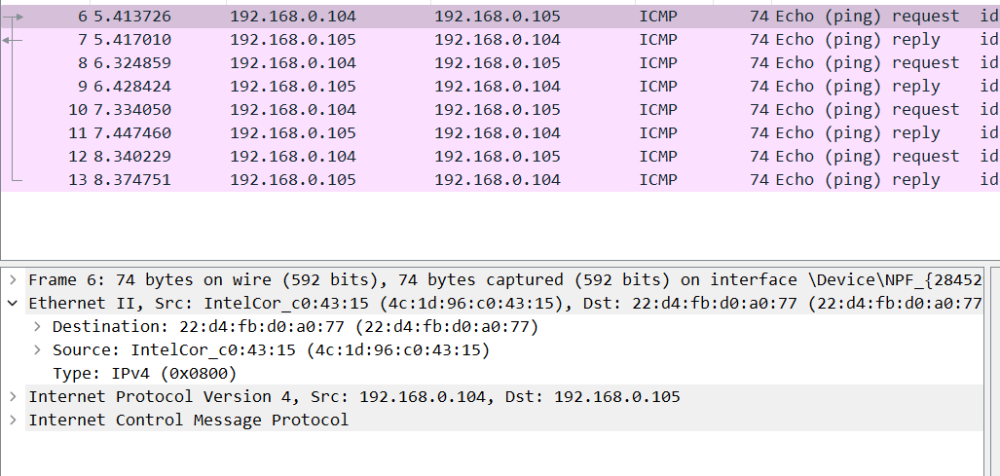
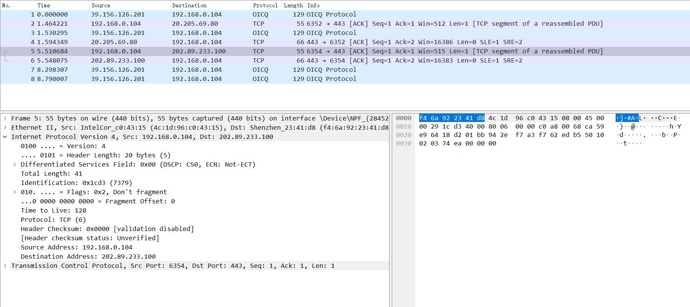
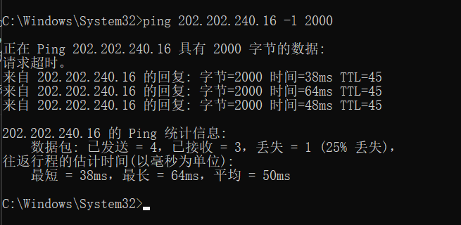
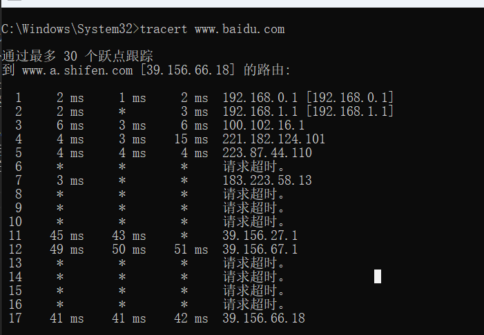

# Wireshark 实验

## 一.数据链路层

### 实作一 ： 熟悉 Ethernet 帧结构

使用 Wireshark 任意进行抓包，熟悉 Ethernet 帧的结构，如：目的 MAC、源 MAC、类型、字段等。
 

使用wireshark进行随意抓包

可以看到中间第二行，就是 **Ethernet 帧**

`Destination:` 目的MAC地址
；` Source:` 源MAC地址
；`type:` 类型

> ✎ 问题 : 
>
>你会发现 Wireshark 展现给我们的帧中没有校验字段，请了解一下原因。

答：Wireshark 在抓包前，物理层网卡已经进行过校验，当我们使用Wireshark进行抓包，抓到的为校验后的包，看到的帧中是没有校验字段。

### 实作二 ： 了解子网内/外通信时的 MAC 地址

>1. ping 你旁边的计算机（同一子网），同时用 Wireshark 抓这些包（可使用 icmp 关键字进行过滤以利于分析），记录一下发出帧的目的 MAC 地址以及返回帧的源 MAC 地址是多少？这个 MAC 地址是谁的？

`发出帧的目的 MAC 地址以及返回帧的源 MAC 地址是：`22:d4:fb:d0:a0:77

这个MAC是**旁边的计算机**

>2. 然后 ping qige.io （或者本子网外的主机都可以），同时用 Wireshark 抓这些包（可 icmp 过滤），记录一下发出帧的目的 MAC 地址以及返回帧的源 MAC 地址是多少？这个 MAC 地址是谁的？

`发出帧的目的 MAC 地址以及返回帧的源 MAC 地址: `f4:6a:92:23:41:d8

这个MAC地址是网关的

>3. 再次 ping www.cqjtu.edu.cn （或者本子网外的主机都可以），同时用 Wireshark 抓这些包（可 icmp 过滤），记录一下发出帧的目的 MAC 地址以及返回帧的源 MAC 地址又是多少？这个 MAC 地址又是谁的？

`发出帧的目的 MAC 地址以及返回帧的源 MAC 地址: `f4:6a:92:23:41:d8

这个MAC地址是网关的

>问题 : 
>通过以上的实验，你会发现：
>
>访问本子网的计算机时，目的 MAC 就是该主机的
>
>访问非本子网的计算机时，目的 MAC 是网关的
>
>请问原因是什么？

答：

访问本子网的计算机不经过网关，可以直接到达，所以目的MAC地址是本机的

访问非本子网的计算机需要先将数据传到网关，通过网关来接受和发送数据，所以目的MAC是网关。

### 实作三 ： 掌握 ARP 解析过程

>1. 为防止干扰，先使用 arp -d * 命令清空 arp 缓存

>2. ping 你旁边的计算机（同一子网），同时用 Wireshark 抓这些包（可 arp 过滤），查看 ARP 请求的格式以及请求的内容，注意观察该请求的目的 MAC 地址是什么。再查看一下该请求的回应，注意观察该回应的源 MAC 和目的 MAC 地址是什么。

`请求的目的 MAC 地址是：`4c:1d:96:c0:43:15，是我旁边计算机的MAC地址

`回应的源 MAC ：` 4c:1d:96:c0:43:15，旁边的计算机

`回应的目的 MAC 地址是：` 4c:1d:96:c0:43:15，自己的计算机

>3. 再次使用 arp -d * 命令清空 arp 缓存
>4. 然后 ping qige.io （或者本子网外的主机都可以），同时用 Wireshark 抓这些包（可 arp 过滤）。查看这次 ARP 请求的是什么，注意观察该请求是谁在回应。

`arp请求：`广播 ； `请求的回应：`网关

>✎ 问题
>
>通过以上的实验，你应该会发现，
>
>1. ARP 请求都是使用广播方式发送的
>2. 如果访问的是本子网的 IP，那么 ARP 解析将直接得到该 IP 对应的 MAC；如果访问的非本子网的 IP， 那么 ARP 解析将得到网关的 MAC。
>
>请问为什么？

答：

访问同一子网的计算机时，如果ARP缓存中有该IP，则直接得到对应的MAC，否则会进行广播，在子网中找到这个ip，获得对应的MAC地址

访问不同子网的计算机时，通过网关发出去，目的IP收到后，将网关的MAC返回去，ARP解析就会得到网关的MAC。

---

## 二.网络层

### 实作一： 熟悉 IP 包结构
使用 Wireshark 任意进行抓包（可用 ip 过滤），熟悉 IP 包的结构，如：版本、头部长度、总长度、TTL、协议类型等字段

`版本：`4 ；`头部长度：`20B ； `总长度：`41 ；`TTL：`128 ； `协议类型：`TCP 

>✎ 问题
>
>为提高效率，我们应该让 IP 的头部尽可能的精简。但在如此珍贵的 IP 头部你会发现既有头部长度字段，也有总长度字段。请问为什么？

答：
便于传输时的识别IP总长度，节省时间，当长度超过1500B时就会被返回链路层进行分段

### 实作二：IP 包的分段与重组

根据规定，一个 IP 包最大可以有 64K 字节。但由于 Ethernet 帧的限制，当 IP 包的数据超过 1500 字节时就会被发送方的数据链路层分段，然后在接收方的网络层重组。

缺省的，ping 命令只会向对方发送 32 个字节的数据。我们可以使用 
ping 202.202.240.16 -l 2000 命令指定要发送的数据长度。此时使用 Wireshark 抓包（用ip.addr == 202.202.240.16  进行过滤），了解 IP 包如何进行分段，如：分段标志、偏移量以及每个包的大小等

`分段标志：`flags是0x1，代表DF=0,MF=1。表示进行分包了，后面还有分片

`偏移量：`0

`包大小：`1500

然后看下一个IP包的

`分段标志：`flags是0x0，代表DF=0,MF=0。表示进行分包了，后面没有分片

`偏移量：`1480

`包大小：`548

>✎ 问题
>
>分段与重组是一个耗费资源的操作，特别是当分段由传送路径上的节点即路由器来完成的时候，所以 IPv6 已经不允许分段了。那么 IPv6 中，如果路由器遇到了一个大数据包该怎么办？

答：
遇到了一个大数据包则丢弃，并发送too big ICMP报文回发送端；分片工作由端系统执行。

### 实作三： 考察 TTL 事件
在 IP 包头中有一个 TTL 字段用来限定该包可以在 Internet上传输多少跳（hops），一般该值设置为 64、128等。

在验证性实验部分我们使用了 tracert 命令进行路由追踪。其原理是主动设置 IP 包的 TTL 值，从 1 开始逐渐增加，直至到达最终目的主机。

请使用 tracert www.baidu.com 命令进行追踪，此时使用 Wireshark 抓包（用 icmp 过滤），分析每个发送包的 TTL 是如何进行改变的，从而理解路由追踪原理

第一跳：

第二跳：

第三跳：

Tracert 首先发送TTL=1的数据包，然后每次发送会将TTL +1，直到目标响应或 TTL 达到最大值。

> ✎ 问题
>
>在 IPv4 中，TTL 虽然定义为生命期即 Time To Live，但现实中我们都以跳数/节点数进行设置。如果你收到一个包，其 TTL 的值为 50，那么可以推断这个包从源点到你之间有多少跳？

答：
接近50的2的阶次的数是64，所以有：64-50=14 跳

## 二.传输层

### 实作一：熟悉 TCP 和 UDP 段结构

>1. 用 Wireshark 任意抓包（可用 tcp 过滤），熟悉 TCP 段的结构，如：源端口、目的端口、序列号、确认号、各种标志位等字段。

`源端口：`1472 `目的端口：` 8883 `序号：` 70`确认号：`70 `报头长度：`20 `标识位：`0x010 (ACK) `校验和：`0x0a34

>2. 用 Wireshark 任意抓包（可用 udp 过滤），熟悉 UDP 段的结构，如：源端口、目的端口、长度等。

`源端口：` 4002 `目的端口：` 8000  `长度：` 55 `UDP校验和：`0x6668

>✎ 问题
>
>由上大家可以看到 UDP 的头部比 TCP 简单得多，但两者都有源和目的端口号。请问源和目的端口号用来干什么？

答：
源端口是发送数据的端口，目的端口是对方主机接收数据的端口

### 实作二：分析 TCP 建立和释放连接

>1. 打开浏览器访问
qige.io   网站，用 Wireshark 抓包（可用 tcp 过滤后再使用加上 
Follow TCP Stream  ）
，不要立即停止 Wireshark 捕获，待页面显示完毕后再多等一段时间使得能够捕获释放连接的包。
>2. 请在你捕获的包中找到三次握手建立连接的包，并说明为何它们是用于建立连接的，有什么特征。

第一次握手： 客户端向服务器发送连接请求包，标志位SYN（同步序号）置为1，序号为X=0

第二次握手： 服务器收到客户端发过来报文，由SYN=1知道客户端要求建立联机。向客户端发送一个SYN和ACK都置为1的TCP报文，设置初始序号Y=0，将确认序号设置为客户的序列号加1，即1

第三次握手：客户端收到服务器发来的包后检查确认序号是否正确，即第一次发送的序号加1。以及标志位ACK是否为1。若正确，客户端再次发送确认包，ACK标志位为1，SYN标志位为0。确认序号1，发送序号为1。服务器收到后确认序号值与ACK=1则连接建立成功

>3. 请在你捕获的包中找到四次挥手释放连接的包，并说明为何它们是用于释放连接的，有什么特征。

第一次挥手： 
 客户端给服务器发送TCP包，用来关闭客户端到服务器的数据传送。将标志位FIN和ACK置为1，序号为2640，确认序号为Z=4907

第二次挥手： 
服务器收到FIN后，发回一个ACK(标志位ACK=1),确认序号为收到的序号加1，即2641。序号为收到的确认序号=4907。

第三次挥手： 
服务器关闭与客户端的连接，发送一个FIN。标志位FIN和ACK置为1，序号为Y=4907，确认序号为X=2641。

第四次挥手： 
客户端收到服务器发送的FIN之后，发回ACK确认(标志位ACK=1),确认序号为收到的序号加1，即4908。序号为收到的确认序号X=2641。

>✎ 问题一
>
>去掉 Follow TCP Stream，即不跟踪一个 TCP 流，你可能会看到访问 qige.io 时我们建立的连接有多个。请思考为什么会有多个连接？作用是什么？

答：
它们之间的连接是属于短连接，一旦数据发送完成后，就会断开连接。断开连接后，页面已经缓存下来。需要重新进行发送数据的话，就要再次进行连接。

这样的连接，是为了实现多个用户进行访问，对业务频率不高的场合，节省通道的使用，不让其长期占用通道。

>✎ 问题二
>
>我们上面提到了释放连接需要四次挥手，有时你可能会抓到只有三次挥手。原因是什么？

答：
第二次握手和第三次挥手合并了

---
## 应用层
应用层的协议非常的多，我们只对 DNS 和 HTTP 进行相关的分析。

### 实作一：了解 DNS 解析
>1. 先使用 ipconfig /flushdns  命令清除缓存，再使用nslookup qige.io   命令进行解析，同时用 Wireshark 任意抓包（可用 dns 过滤）。

>2. 你应该可以看到当前计算机使用 UDP，向默认的 DNS 服务器的 53 号端口发出了查询请求，而 DNS 服务器的 53 号端口返回了结果。

>3. 可了解一下 DNS 查询和应答的相关字段的含义

1. `QR：`查询/应答标志。0表示这是一个查询报文，1表示这是一个应答报文
2. `opcode：`定义查询和应答的类型。0表示标准查询，1表示反向查询（由IP地址获得主机域名），2表示请求服务器状态
3. `AA：`授权应答标志，仅由应答报文使用。1表示域名服务器是授权服务器
4. `TC：`截断标志，仅当DNS报文使用UDP服务时使用。因为UDP数据报有长度限制，所以过长的DNS报文将被截断。1表示DNS报文超过512字节，并被截断
5. `RD：`递归查询标志。1表示执行递归查询，即如果目标DNS服务器无法解析某个主机名，则它将向其他DNS服务器继续查询，如此递归，直到获得结果并把该结果返回给客户端。0表示执行迭代查询，即如果目标DNS服务器无法解析某个主机名，则它将自己知道的其他DNS服务器的IP地址返回给客户端，以供客户端参考
6. `RA：`允许递归标志。仅由应答报文使用，1表示DNS服务器支持递归查询
7. `zero：`这3位未用，必须设置为0
8. `rcode：`4位返回码，表示应答的状态。常用值有0（无错误）和3（域名不存在）

>✎ 问题
>
>你可能会发现对同一个站点，我们发出的 DNS 解析请求不止一个，思考一下是什么原因？

答：
访问的网址虽然只是一个域名，但是会有多个台服务器主机，域名解析服务器可能有很多个，所以会同时向几个域名解析服务器发出请求。

### 实作二：了解 HTTP 的请求和应答
打开浏览器访问 qige.io 网站，用 Wireshark 抓包（可用http 过滤再加上Follow TCP Stream  ），不要立即停止 Wireshark 捕获，待页面显示完毕后再多等一段时间以将释放连接的包捕获。

请在你捕获的包中找到 HTTP 请求包，查看请求使用的什么命令，如：GET, POST。并仔细了解请求的头部有哪些字段及其意义。

`使用的命令：`GET

`Accept：`告诉服务器客户端浏览器这边可以出里什么数据；

`Accept-Encodeing：`gzip 告诉服务器我能支持什么样的压缩格式

`accept-language：`告诉服务器浏览器支持的语言

`Cache-control：`告诉服务器是否缓存

`Connection:keep-alive：` 告诉服务器当前保持活跃（与服务器处于链接状态）

`Host：`远程服务器的域名

`User-agent：`客户端的一些信息，浏览器信息 版本

`referer：`当前页面上一个页面地址。一般用于服务器判断是否为同一个域名下的请求

请在你捕获的包中找到 HTTP 应答包，查看应答的代码是什么，如：200, 304, 404 等。并仔细了解应答的头部有哪些字段及其意义。

`应答的代码：`200

`cache-control：`private/no-cache; 私有的不需要缓存/no-cache也不需要缓存

`content-length：`内容长度

`content-type：`text/css;返回内容支持格式

`Date：` 当前的GMT时间

`server：`ngnix 服务器类型

>✎ 问题
>
>刷新一次 qige.io 网站的页面同时进行抓包，你会发现不少的 304 代码的应答，这是所请求的对象没有更改的意思，让浏览器使用本地缓存的内容即可。那么服务器为什么会回答 304 应答而不是常见的 200 应答？

答：

304表示可以直接在缓存区获取到需要的内容，不需要服务器再次回复对应的内容，减少服务器的一些工作，减小开销。

如果采用200应答就是要完全的将内容发送给客服端，会增加服务器的一些开销。
